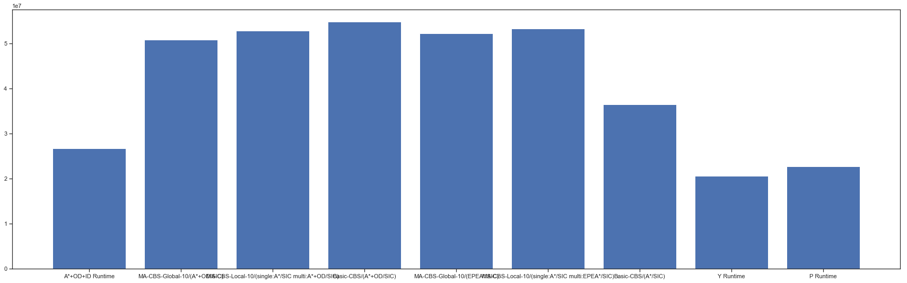
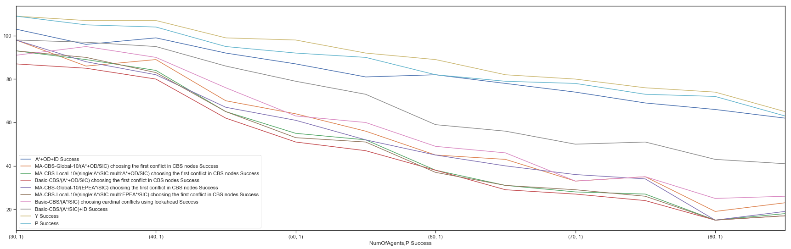

## This is a fork of [roni stern's MAPF Project](https://github.com/ronistern/mapf) ##

# MAPF - Multi Agent Path Finding

A suite of multi-agent path finding algorithm implementations and simulator.

## How to run ##
In `Run.cs` you need to add your `ISolver` implementation to `solvers` List. 
After your addition, go to `Program.cs`. 
At the main function you can choose to run in either one of the next modes:
1. `runGrids` - You programtically define, using int arrays, the grid size, obstacles and agents. Then you run `RunExperimentSet` function with the given inputs.
2. `runDragonAge` - Use predefined grids of variant large sizes. The number of agents defined at a list at `RunDragonAgeExperimentSet` , currently set to a range of 5 to 100 agents. (Computationally very expensive from ~30 agents - will take long time)
3. `runMazesWidth1` - Currently not available.
4. `runSpecific`  - Will use grid definition file from `bin\Debug\instances`. Currently uses `Instance-4-0-3-0` -  a grid of 4x4 with 3 agents and no obstacles

## Run.cs docs ##
At the ctor we init solvers and heuristics lists. they will be used by inner functions.
At `GenerateProblemInstance` we generate a grid by size, number of agents and number of obstacles.
	obstacles and agent locations choosen randomly.

## Classification - who is the best MAPF for the job? ##
In order to find which is the best MAPF algorithm for every task, we trained an XGBoost classifier.
The data & notebooks for training can be found under `classification` directory.

### Cumulative running time sum per algorithm ###

### Number of problems solved under 5 minutes per algorithm ###

## Currently implemented Solvers ##
1. AStar and it's variations (Operator Decompsition, PartialExpansion, Independence Detection)
2. CBS and it's variations
3. ICTS 

## Currently implemented Hueristics ##
1. SIC - Sum of Individual costs

## Solvers TODO list ##
- [ ] M Star (Refactor it out from ClassicAStar)
- [ ] Solve MAPF as a SAT problem
- [ ] Solve MAPF as a combinatorial auction problem

## Refactoring TODO List & Questions ##
- [ ] Create enum for obstacles
- [ ] At `Program.cs` - runMazesWidth1 will cause exception due to missing grid definition files 
- [ ] Create `GridDefinitions` class for handling reading of definition files 
- [x] Move all 'ISolver' implementations to different folder
- [ ] Create `Parser` for parsing the `GridDefinitions` (`Parser` Interface and `textFileParser` implementation, leaving space for future format parsers) 
